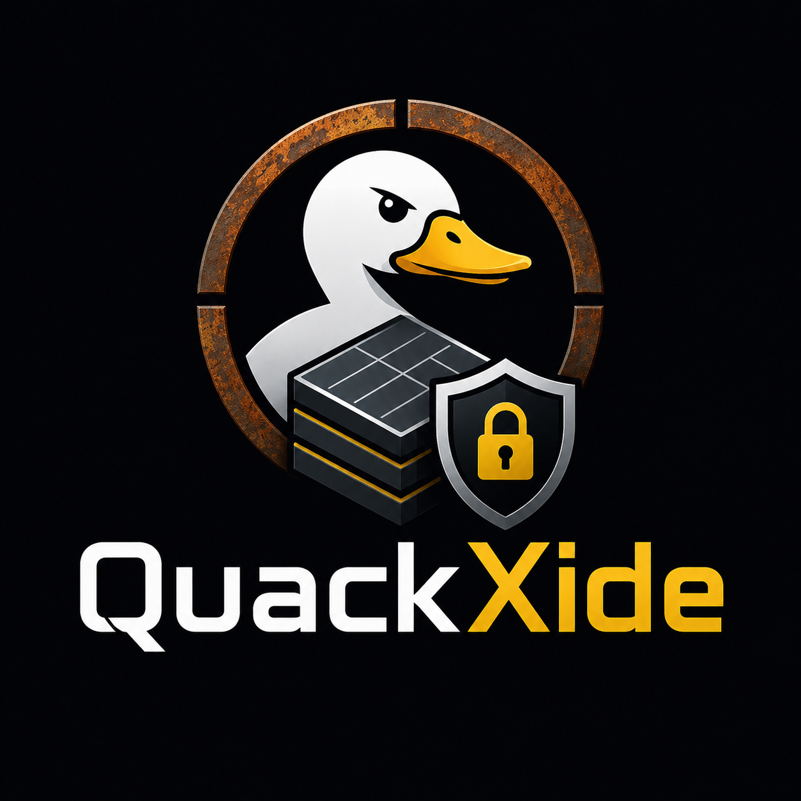

<p align="center"></p>

# QuackXide

**A secure database and data-processing system for sensitive and protected
data.**

> Data goes in. Analysis comes out. The dataset doesn't.

## Purpose

QuackXide stores, queries, and analyzes sensitive and protected data without
exposing it in the clear:

* **Encrypted in** — data is encrypted on the owner's device, or inside an
  attested enclave, before it is stored.
* **Encrypted at rest** — storage holds ciphertext under keys the operator
  does not hold.
* **Encrypted out** — results leave encrypted to the recipient, after
  disclosure controls. Rows never leave.
* **Minimal plaintext surface** — plaintext exists only in attested enclave
  memory, for one query, and is zeroized afterwards.

The governing rule is the **no-naked-data invariant**: no normal application
path lets an analytics user retrieve an unrestricted plaintext dataset.
There is no CSV export, table dump, or `SELECT *` path.

QuackXide is built for security, efficiency, speed, and reliability in
production — fail-closed behavior, tested failure paths, durable state,
measured performance, and reproducible deployment.

## Why

Trusted research environments (TREs) keep sensitive data in a locked-down
workspace, admit vetted people on approved projects, and review every
export by hand. What they enforce is largely policy:

* **They trust the researcher.** Researchers see record-level data inside
  the workspace; downloading it is forbidden by contract, not prevented. In
  April 2026, data on UK Biobank's 500,000 participants was listed for sale
  after researchers with approved access downloaded it
  ([The Register](https://www.theregister.com/2026/04/23/500k_biobank_volunteers_data_listed/),
  [Health Research Authority](https://www.hra.nhs.uk/about-us/news-updates/our-response-to-concerns-over-uk-biobank-data/)).
  An HHS OIG audit of the NIH All of Us Researcher Workbench found users
  could download prohibited participant data by ticking a certification box
  ([A-18-24-06111](https://oig.hhs.gov/documents/audit/11266/A-18-24-06111.pdf)).
* **They trust the reviewer.** Manual output checking is slow and misses
  record-level data hidden in outputs.
* **They trust the operator.** Plaintext on the operator's disks is readable
  by staff, a stolen credential, a misconfigured log, or a subpoena.

QuackXide replaces each with a mechanism: researchers never receive rows,
disclosure control runs in the query engine, and the operator never holds a
key that opens the data.

## How it works

1. **Ingress.** Drive files are encrypted in the browser (Web Crypto,
   non-extractable keys, AES-256-GCM). Connector pipelines sync external
   sources into attested SEV-SNP memory, shape them into Parquet, and seal
   them to the tenant's HPKE key before anything persists.
2. **Storage.** Ciphertext only, in HPKE envelopes with versioned framing
   and context binding. Storage paths are built only from typed tenant ids,
   so cross-tenant access cannot be expressed.
3. **Query.** Apache DataFusion runs inside the enclave over transiently
   decrypted Parquet. A logical-plan allowlist admits only simple aggregate
   queries; each must carry a genuine `COUNT(*) AS n`, and cohorts below
   `RESEARCH_MIN_COHORT_SIZE` are suppressed. Blind indexes support
   equality search without decryption.
4. **Research access.** A steward grants a researcher a finite query
   budget, spent before execution and never refunded. Research queries
   pass the same gate.

Every security decision, including denials, is written to a
`SECURITY_AUDIT_EVENT` stream with identifiers and outcomes only.

| Document | Contents |
| --- | --- |
| `docs/ARCHITECTURE.md` | Trust model, dataflows, crate boundaries, cryptography, audit stream |
| `docs/THREAT_MODEL.md` | Assets, adversaries, controls, residual risk |
| `docs/PROJECT_SCOPE.md` | Release scope and definition of done |
| `docs/V1_PLAN.md` | v1.0 plan: work items, order, and the issues they map to |
| `docs/DATA_POLICY.md` | Synthetic and public data only |
| `docs/adr/` | Architecture decision records |

## Layout

```
backend/crates/
  platform-core/          Typed tenant/object ids, connector slugs, ZK mode
  platform-config/        Env-driven config (brand, features, research)
  platform-telemetry/     JSON tracing + SECURITY_AUDIT_EVENT stream
  platform-crypto/        AEAD, HPKE envelopes, blind indexes, TOTP
  platform-auth/          JWT verification (dev HS256, RS256/JWKS) + keygen
  platform-storage/       Tenant-isolated ciphertext vault (GCS / in-memory)
  platform-enclave/       SEV-SNP attestation (fail-closed)
  platform-connectors/    Connector catalog, OAuth2, NDJSON, Parquet-out
  platform-tenancy/       Tenants, grants, budgets, dataset catalog
  platform-billing/       Merchant-of-Record webhook verification
  quackxide-engine/       QueryScope, plan gate, disclosure policies
  platform-api/           HTTP edge (binary) + integration tests
frontend/src/
  lib/crypto/             Web Crypto worker (keys never touch the UI thread)
  lib/vault/              Ciphertext-only vault clients (local / http)
  components/             Drive, researcher portal, steward console, admin
scripts/check.sh          Validation gate — run before every push
scripts/hooks/            Git hooks
```

## Development

Backend (Rust, pinned in `rust-toolchain.toml`), from `backend/`:

```sh
cp .env.example .env
cargo run -p platform-api        # /healthz, /api/v1/meta
```

Frontend (Node, pinned in `.nvmrc`), from `frontend/`:

```sh
cp .env.example .env
npm install && npm run dev       # http://localhost:5173
```

End-to-end locally, from `backend/`:

```sh
export JWT_HS256_SECRET=$(openssl rand -hex 32)
cargo run -p platform-api                    # terminal 1
cargo run -p platform-api --bin devtoken     # terminal 2: prints a token
# frontend/.env: VITE_VAULT_MODE="http", VITE_DEV_JWT="<token>"
cargo run -p platform-api --bin query-demo   # sealed-query round trip
```

Before every push, run `scripts/check.sh` and enable the hooks once with
`git config core.hooksPath scripts/hooks`.

**White-label.** Customer-facing names, domains, and endpoints are
configuration (`APP_PUBLIC_NAME`, `APP_DOMAIN_NAME`, `VITE_APP_*`).
`scripts/check.sh` fails if the engine name reaches the frontend bundle.

## Status

The architecture is implemented and tested end-to-end against synthetic
data; it is not yet deployed to production. Remaining for the first
production release (details in `docs/PROJECT_SCOPE.md`):

* **Sign-in** — RS256/JWKS verification and TOTP exist; the managed
  sign-in service does not. Development uses HS256 tokens.
* **Attestation** — SEV-SNP report verification is not implemented; with
  `TEE_ATTESTATION_REQUIRED=true` every sync is refused.
* **Key release** — the enclave key-release path is not wired; query
  endpoints return 503 in production builds.
* **Durability** — registries are in-memory behind traits.
* **Encrypted results** — results currently leave as JSON over TLS.
* **Post-quantum cryptography** — target is X25519 + ML-KEM-768 and
  Ed25519 + ML-DSA-65; current suites are X25519 and RS256.

## Contributing

Read `CONTRIBUTING.md` and `CODE_OF_CONDUCT.md`. Report vulnerabilities
privately per `SECURITY.md`. Changes are recorded in `CHANGELOG.md`.

**Contributors:** AxolDad — Jeremy L.D. Ryan (founder and maintainer); the
USF core contribution team — Jake Abendroth, William Shenker, Angelina Tam,
and Gabriel Zubovsky. Full list in `CONTRIBUTORS.md`.

## License

Copyright 2026 Code Pause, Inc., Jeremy L.D. Ryan (@AxolDad) <Jeremy.Ryan@codepause.com>.

Licensed under either of Apache License, Version 2.0 (`LICENSE-APACHE`) or
MIT license (`LICENSE-MIT`), at your option. Unless you explicitly state
otherwise, any contribution intentionally submitted for inclusion in
QuackXide by you, as defined in the Apache-2.0 license, shall be
dual-licensed as above, without any additional terms or conditions.
